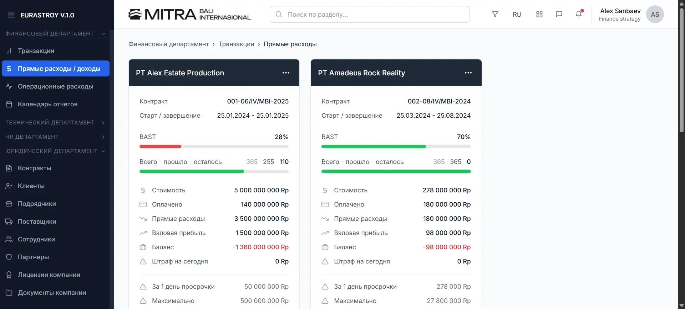

# Proyek Dashboard Keuangan - React & Tailwind CSS

Ini adalah proyek antarmuka pengguna (frontend) yang dibangun menggunakan React dan Tailwind CSS. Tujuan dari proyek ini adalah untuk menampilkan data keuangan dan proyek secara visual melalui serangkaian komponen dashboard yang informatif dan terstruktur dengan baik.

## Tampilan Dashboard



## Fitur Utama

- **Tabel Transaksi Interaktif**: Menampilkan data pengeluaran dengan fitur filter, sorting (implied), dan aksi per baris.
- **Ringkasan KPI (Key Performance Indicator)**: Panel yang menampilkan metrik-metrik kunci performa bisnis dalam format yang mudah dibaca.
- **Kartu Proyek Dinamis**: Kartu ringkasan untuk setiap proyek yang menunjukkan progres, detail kontrak, dan statistik keuangan.
- **Desain Responsif**: Komponen dirancang untuk bekerja dengan baik di perangkat desktop maupun seluler.
- **Arsitektur Komponen yang Reusable**: Dibuat dengan prinsip komposisi untuk kemudahan pemeliharaan dan skalabilitas.

## Teknologi yang Digunakan

- **[React](https://reactjs.org/)**: Library JavaScript untuk membangun antarmuka pengguna.
- **[Tailwind CSS](https://tailwindcss.com/)**: Framework CSS utility-first untuk desain yang cepat dan kustom.
- **[React Icons](https://react-icons.github.io/react-icons/)**: Library untuk menyertakan ikon populer dalam proyek React.

---

## Memulai Proyek

Untuk menjalankan proyek ini di lingkungan lokal Anda, ikuti langkah-langkah berikut:

1.  **Clone repository ini:**

    ```sh
    git clone https://github.com/alifsuryadi/responsive-finance-ui-kit.git
    ```

2.  **Masuk ke direktori proyek:**

    ```sh
    cd responsive-finance-ui-kit
    ```

3.  **Instal semua dependensi yang dibutuhkan:**

    ```sh
    npm install
    ```

4.  **Jalankan aplikasi dalam mode pengembangan:**
    ```sh
    npm run dev
    ```
    > Buka [http://localhost:8080](http://localhost:8080) untuk melihatnya di browser.

---
